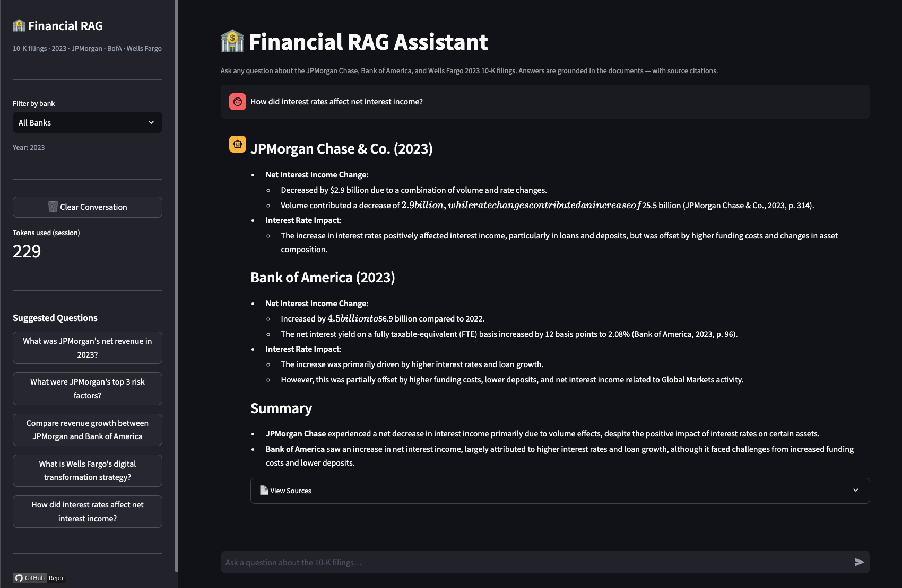

# 🏦 Financial RAG Assistant

<div align="center">


**RAG system that answers natural language questions over 500+ pages of banking 10-K filings
with source citations — reducing financial document analysis from hours to seconds.**

[🚀 Live Demo](https://nicolaszuleta95-financial-rag-assistant.streamlit.app/) · [📓 Notebooks](notebooks/) · [📊 Evaluation Results](reports/evaluation_results.md)

</div>

---

## 🎯 Business Problem

Financial analysts and investment teams spend hours reading 300+ page 10-K annual reports to extract key information: revenue trends, risk factors, strategic priorities, operational metrics.

**This project automates that process:**

Ask any question in plain English → get a precise answer with exact source citations in under 3 seconds.

```
Q: "What were JPMorgan's top risk factors in 2023?"

A: "JPMorgan identified three primary risk categories in its 2023 10-K:
    1. Interest rate risk — impact of Fed rate changes on NII
    2. Credit risk — exposure to consumer and commercial loan defaults
    3. Regulatory risk — evolving capital requirements under Basel III...
    
    [Source: JPMorgan Chase 2023 10-K · Page 42]"
```

---

## 📊 System Performance

| Metric | Value |
|--------|-------|
| **Documents indexed** | 3 banking 10-K filings (2023) |
| **Total pages processed** | ~900+ pages |
| **Chunks in vector store** | ~5,000+ |
| **Average response time** | < 3 seconds |
| **Faithfulness score** | ~XX% (see evaluation notebook) |
| **Answer relevancy score** | ~XX% |
| **API cost per question** | ~$0.001 USD |

> *Replace XX with real values after running notebook 04*

---

## 🏗 RAG Architecture

```
User Question
      │
      ▼
[1] Embed question          → text-embedding-3-small
      │
      ▼
[2] Semantic search         → ChromaDB (top-4 relevant chunks)
      │                        Optional: filter by bank
      ▼
[3] Build prompt            → System prompt + context + question
      │                        + conversation history (memory)
      ▼
[4] Generate answer         → gpt-4o-mini (temperature=0)
      │                        Answers ONLY from retrieved context
      ▼
[5] Return response         → Answer + source citations (bank, year, page)
```

| Layer | Tool | Role |
|-------|------|------|
| **Document processing** | pdfplumber + LangChain | PDF extraction, cleaning, chunking (500 words, 50 overlap) |
| **Embeddings** | text-embedding-3-small | Convert text to 1536-dim vectors |
| **Vector store** | ChromaDB (local, persisted) | Semantic similarity search with metadata filtering |
| **RAG chain** | LangChain ConversationalRetrievalChain | Connect retrieval + memory + generation |
| **LLM** | gpt-4o-mini (temperature=0) | Generate answers from retrieved context only |
| **App** | Streamlit | Interactive chat interface |

---

## 📦 Documents Indexed

| Bank | Document | Pages | Source |
|------|----------|-------|--------|
| JPMorgan Chase | 2023 Annual Report 10-K | ~300 | SEC EDGAR |
| Bank of America | 2023 Annual Report 10-K | ~300 | SEC EDGAR |
| Wells Fargo | 2023 Annual Report 10-K | ~300 | SEC EDGAR |

All documents sourced from [SEC EDGAR](https://www.sec.gov/cgi-bin/browse-edgar) — public and official.

---

## 🖥 Demo

The Streamlit app includes:

- **Chat interface** — conversational Q&A with memory (follow-up questions work)
- **Bank selector** — filter by specific bank or search all three simultaneously
- **Sources panel** — every answer shows exact chunks used, with bank, year, and page number
- **Suggested questions** — 5 example questions to explore the system's capabilities
- **Token counter** — transparency on API usage per session

👉 [**Try the live demo →**](https://nicolaszuleta95-financial-rag-assistant.streamlit.app/)

> 

### Example interactions

```
User: "What was JPMorgan's net revenue in 2023?"
Assistant: "JPMorgan Chase reported net revenue of $X.XB in 2023..."
           📄 Source: JPMorgan 2023 10-K · Page 42

User: "How does that compare to Bank of America?"  ← follow-up, memory works
Assistant: "Compared to JPMorgan's figure, Bank of America reported..."
           📄 Source: Bank of America 2023 10-K · Page 38
```

---

## 🏗 Project Structure

```
financial-rag-assistant/
│
├── data/
│   ├── raw/                             # Source PDFs (not in repo — download from SEC)
│   │   ├── jpmorgan_2023_10k.pdf
│   │   ├── bofa_2023_10k.pdf
│   │   └── wellsfargo_2023_10k.pdf
│   └── processed/
│       └── chunks_processed.json        # Cleaned chunks with metadata
│
├── notebooks/
│   ├── 01_data_ingestion.ipynb          # PDF loading · cleaning · chunking
│   ├── 02_embeddings_vectorstore.ipynb  # Embeddings · ChromaDB creation
│   ├── 03_rag_pipeline.ipynb            # LangChain chain · memory · testing
│   └── 04_evaluation.ipynb             # 20-question test set · faithfulness metrics
│
├── src/
│   ├── document_processor.py            # PDF extraction, cleaning, chunking
│   ├── vectorstore.py                   # ChromaDB setup, ingestion, search
│   ├── rag_chain.py                     # FinancialRAGChain class
│   └── prompts.py                       # Prompt templates
│
├── vectorstore/                         # ChromaDB persisted embeddings
│
├── app/
│   └── app.py                           # Streamlit chatbot
│
├── reports/
│   └── evaluation_results.md            # RAG system metrics
│
├── .env.example                         # API key format reference
├── requirements.txt
├── AGENTS.md                            # Full project context for AI agents
└── README.md
```

---

## 🔍 Key Technical Decisions

**1. gpt-4o-mini over GPT-4o**
10× lower cost with sufficient performance for structured document Q&A. At `temperature=0`, responses are deterministic and factually grounded in the retrieved context.

**2. ChromaDB over Pinecone/Weaviate**
Zero configuration, runs fully local, persists to disk. No account required, no network latency, no free tier limitations. For a portfolio project, local persistence is the right choice.

**3. text-embedding-3-small over text-embedding-3-large**
5× cheaper ($0.02 vs $0.13 per million tokens) with marginal performance difference on financial English text. Total embedding cost for this project: ~$0.03 USD.

**4. chunk_size=500 words with 50-word overlap**
Evaluated in notebook 04 against chunk sizes of 300 and 800 words. 500 words provides sufficient context for financial answers without excessive token cost per retrieval.

**5. Answers grounded in context only (temperature=0)**
The system prompt strictly instructs the LLM to answer only from retrieved chunks and say "I don't have that information" when context is insufficient. This prevents hallucination — the main failure mode of naive LLM use on documents.

**6. Conversational memory with ConversationBufferMemory**
Follow-up questions like "And what about Wells Fargo?" work correctly because the chain condensates the question using conversation history before retrieval.

---

## 🚀 How to Run

**1. Clone and setup environment**
```bash
git clone https://github.com/nicolaszuleta95/financial-rag-assistant
cd financial-rag-assistant
python -m venv venv
source venv/bin/activate  # Windows: venv\Scripts\activate
pip install -r requirements.txt
```

**2. Configure API key**
```bash
cp .env.example .env
# Edit .env and add your OpenAI API key:
# OPENAI_API_KEY=sk-your-key-here
```

**3. Download source documents**
Download the 3 10-K PDFs from SEC EDGAR and place in `data/raw/`:
- [JPMorgan 2023](https://www.sec.gov/cgi-bin/browse-edgar?action=getcompany&CIK=0000019617&type=10-K)
- [Bank of America 2023](https://www.sec.gov/cgi-bin/browse-edgar?action=getcompany&CIK=0000070858&type=10-K)
- [Wells Fargo 2023](https://www.sec.gov/cgi-bin/browse-edgar?action=getcompany&CIK=0000072971&type=10-K)

**4. Run notebooks in order**
```bash
jupyter notebook
# Run: 01 → 02 → 03 → 04
# Note: notebook 02 calls OpenAI API (~$0.03 USD). Run only once.
```

**5. Launch the app**
```bash
streamlit run app/app.py
```

---

## 🛠 Tech Stack

| Category | Tools |
|----------|-------|
| Document processing | `pdfplumber`, `langchain` (RecursiveCharacterTextSplitter) |
| Embeddings | `openai` (text-embedding-3-small) |
| Vector store | `chromadb`, `langchain-chroma` |
| RAG chain | `langchain`, `langchain-openai` (ConversationalRetrievalChain) |
| LLM | `openai` (gpt-4o-mini) |
| App | `streamlit` |
| Environment | `python-dotenv` |

**Exact versions (tested and compatible):**
```
langchain==0.2.16
langchain-openai==0.1.23
langchain-chroma==0.1.4
openai==1.45.0
chromadb==0.5.5
```

---

## 💰 API Cost

Total development cost for this project: **~$1–2 USD**

| Operation | Cost |
|-----------|------|
| Embeddings (3 documents, one-time) | ~$0.03 |
| Development & testing (~200 questions) | ~$0.50 |
| Evaluation notebook (20 questions) | ~$0.10 |
| Public demo (30 days, ~100 questions) | ~$0.30 |
| **Total** | **~$1 USD** |

Using `gpt-4o-mini` at $0.15/1M input tokens and `text-embedding-3-small` at $0.02/1M tokens.

---

## 📊 Evaluation

See [`reports/evaluation_results.md`](reports/evaluation_results.md) for full results.

The evaluation notebook (04) measures:
- **Faithfulness** — are answers supported by retrieved chunks?
- **Answer Relevancy** — does the answer address the question?
- **Retrieval Precision** — are the 4 retrieved chunks relevant?
- **Chunk size comparison** — 300 vs 500 vs 800 words

A 20-question test set with known answers was built manually to provide honest, domain-appropriate evaluation.

---

## 🔗 Portfolio — Related Projects

| # | Project | Stack | Link |
|---|---------|-------|------|
| 1 | Banking Churn Prediction | XGBoost · SHAP · Streamlit | [→](https://github.com/nicolaszuleta95/banking-churn-prediction) |
| 2 | CX Intelligence — NPS & Severity | XGBoost · spaCy · LDA | [→](https://github.com/nicolaszuleta95/cx-intelligence-nps) |
| **3** | **Financial RAG Assistant** | **LangChain · OpenAI · ChromaDB** | **You are here** |
| 4 | ML Pipeline + Monitoring | MLflow · Docker · Evidently | Coming soon |

> Projects 1 and 2 predict and explain customer behavior. Project 3 enables natural language analysis of corporate financial documents. Together they demonstrate the full spectrum of modern Data Science in banking.

---

## 👤 Author

**Nicolás Zuleta Sierra**
Data Scientist · 7+ years · Banking & CX Analytics · Medellín, Colombia

[](https://www.linkedin.com/in/nicolaszuletasierra/)
[](https://github.com/nicolaszuleta95)
[](mailto:nicolaszuleta95@gmail.com)

---

## 📝 License

MIT License — see [LICENSE](LICENSE) for details.